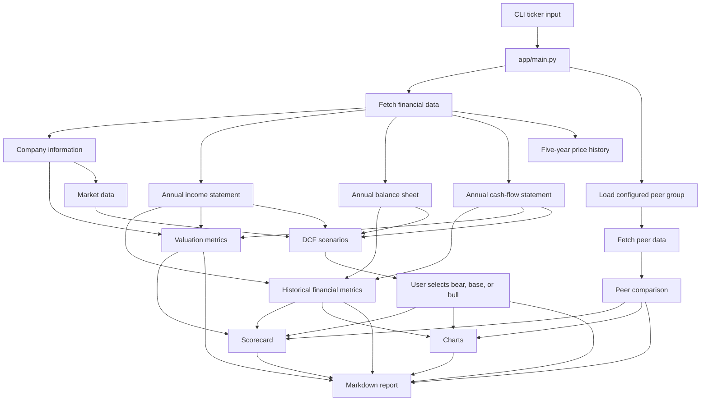

# Architecture

## Overview

Quant AI Analyst is a **Python prototype** that automates the main steps of a basic equity-analysis workflow.

A user provides a stock ticker, and the application:

1. retrieves public financial and market data;
2. calculates historical financial metrics;
3. calculates valuation ratios;
4. runs bear, base, and bull DCF scenarios;
5. compares the company with a configured peer group;
6. generates a transparent scorecard;
7. creates charts;
8. saves a Markdown investment report.

The current working core is a deterministic Python pipeline. Files for SEC filings, recent news, LLM integration, agents, a Streamlit interface, and PDF export are part of the planned architecture but are not yet connected to the main application.

Related documentation:

- [Data sources](data_sources.md)
- [DCF methodology](dcf_methodology.md)
- [Current limitations](limitations.md)
- [Roadmap](roadmap.md)

---

## Current workflow



---

## Entry point

The application is run from the repository root:

```bash
python -m app.main --ticker NVDA
```

`app/main.py` coordinates the pipeline in the following order:

1. normalise the ticker to uppercase;
2. retrieve financial and market data;
3. calculate historical metrics;
4. calculate valuation metrics;
5. run all three DCF scenarios;
6. ask the user to select one scenario;
7. retrieve and analyse the configured peers;
8. generate the scorecard;
9. generate charts;
10. generate the Markdown report.

At present, the CLI accepts only `--ticker`. DCF scenario selection is interactive.

---

## Repository layers

### Application orchestration

#### `app/main.py`

Coordinates the complete prototype workflow and passes data between the tool, analysis, visualisation, and report modules.

#### `app/config.py`

Reserved for central project settings. It is not currently used by the active pipeline.

#### `app/constants.py`

Stores fixed configuration values, including:

- manually configured peer groups;
- scorecard category weights.

---

### Data and tool layer

#### `app/tools/financial_data.py`

Retrieves data through `yfinance`.

Implemented functions collect:

- annual income statements;
- annual balance sheets;
- annual cash-flow statements;
- company and market metadata;
- five years of historical daily prices.

The module also selects a subset of relevant rows so the other modules receive a more consistent structure.

#### `app/tools/competitor_analysis.py`

Handles peer analysis.

It:

- loads a predefined peer group;
- retrieves data for the target and each peer;
- calculates comparable metrics;
- calculates peer medians;
- classifies the target as above, below, or broadly in line with peers;
- creates a peer-comparison table;
- produces a quality-adjusted valuation label.

#### Planned tool modules

The following files are placeholders for later functionality:

- `app/tools/ticker_resolver.py`
- `app/tools/sec_filings.py`
- `app/tools/news_search.py`
- `app/tools/llm_client.py`

They should not currently be described as implemented features.

---

### Analysis layer

#### `app/analysis/metrics.py`

Calculates annual historical metrics:

- revenue growth;
- gross margin;
- operating margin;
- net margin;
- free cash flow;
- free-cash-flow margin.

The result is a `pandas.DataFrame` with metrics as rows and fiscal years as columns.

#### `app/analysis/valuation.py`

Calculates:

- price-to-earnings ratio;
- price-to-sales ratio;
- free-cash-flow yield.

The current implementation combines current market capitalisation with the latest available annual financial values.

#### `app/analysis/dcf.py`

Contains the DCF functions for:

- projecting revenue;
- projecting free cash flow;
- discounting forecast cash flows;
- calculating terminal value;
- calculating equity value;
- calculating fair value per share;
- generating a DCF sensitivity table;
- running bear, base, and bull scenarios.

See [dcf_methodology.md](dcf_methodology.md) for the assumptions, formulas, and current prototype constraints.

#### `app/analysis/scoring.py`

Produces scores from 1 to 5 for:

- growth;
- profitability;
- balance sheet;
- valuation;
- risk.

The category scores are combined using fixed weights and mapped to a recommendation label.

The scorecard is an interpretable prototype heuristic. It has not been backtested or statistically validated as a predictor of future returns.

#### `app/analysis/risk_analysis.py`

Reserved for a future qualitative and quantitative risk-analysis layer.

---

### Visualisation layer

#### `app/visualization/plots.py`

Creates PNG charts for:

- annual revenue;
- annual profit margins;
- annual free cash flow;
- DCF sensitivity;
- peer valuation multiples.

Generated charts are stored in:

```text
outputs/charts/
```

---

### Report layer

#### `app/reports/report_generator.py`

Builds and saves the current Markdown investment report.

The report includes:

- company overview;
- financial-metrics table;
- valuation metrics;
- DCF output and assumptions;
- peer comparison;
- scorecard;
- generated chart paths;
- preliminary recommendation;
- disclaimer.

Generated reports are stored in:

```text
outputs/markdown/
```

#### Planned report modules

The following files exist for later development:

- `app/reports/markdown_builder.py`
- `app/reports/pdf_exporter.py`
- `app/reports/templates/investment_report.md`

---

### Agent and interface layers

The following modules are architectural placeholders:

```text
app/agents/
├── planner.py
├── analyst_agent.py
└── critic_agent.py

app/ui/
└── streamlit_app.py
```

The prototype does not currently use an autonomous agent or Streamlit application.

The intended future role of these components is:

- coordinate the deterministic analysis pipeline;
- add source-grounded explanations;
- check reports for missing sections and numerical inconsistencies;
- provide a simple browser interface.

---

## Current data structures

The prototype primarily passes Python dictionaries, lists, and pandas objects between modules.

### Financial-data dictionary

```python
{
    "company_info": dict,
    "income_statement": pandas.DataFrame,
    "balance_sheet": pandas.DataFrame,
    "cash_flow": pandas.DataFrame,
    "historical_prices": pandas.DataFrame,
}
```

### DCF result

```python
{
    "fair_value_per_share": float,
    "enterprise_value": float,
    "equity_value": float,
    "projected_revenue": list[float],
    "projected_fcf": list[float],
    "discounted_fcf": list[float],
    "terminal_value": float,
    "discounted_terminal_value": float,
    "assumptions": dict,
    "dcf_sensitivity_table": pandas.DataFrame,
}
```

### Scorecard

```python
{
    "scores": {
        "growth": int,
        "profitability": int,
        "balance_sheet": int,
        "valuation": int,
        "risk": int,
    },
    "overall_score": float,
    "recommendation": str,
    "weights": dict,
}
```

Typed schemas are planned but are not currently enforced.

---

## Output structure

A successful run is intended to produce:

```text
outputs/
├── charts/
│   ├── <TICKER>_revenue.png
│   ├── <TICKER>_margins.png
│   ├── <TICKER>_free_cash_flow.png
│   ├── <TICKER>_dcf_sensitivity.png
│   └── <TICKER>_peer_valuation.png
└── markdown/
    └── <TICKER>_investment_report.md
```

Some output integration issues remain in the current prototype and are listed in [limitations.md](limitations.md).

---

## Design decisions

### Deterministic calculations first

Financial metrics, valuation ratios, DCF calculations, peer comparisons, and scores are produced by Python functions.

A future LLM layer should explain the calculated evidence rather than generate the underlying numbers.

### Modular separation

Data retrieval, calculation, comparison, visualisation, and reporting are separated into different modules. This makes the prototype easier to understand, test, and extend.

### Explicit assumptions

DCF assumptions, peer groups, score thresholds, and category weights are visible in the source code.

### Prototype-first development

The current design prioritises a working end-to-end demonstration over production features such as caching, immutable data snapshots, retries, typed interfaces, and deployment.

### Honest feature boundaries

Implemented functionality and planned functionality are documented separately so that the repository does not overstate its current capabilities.
